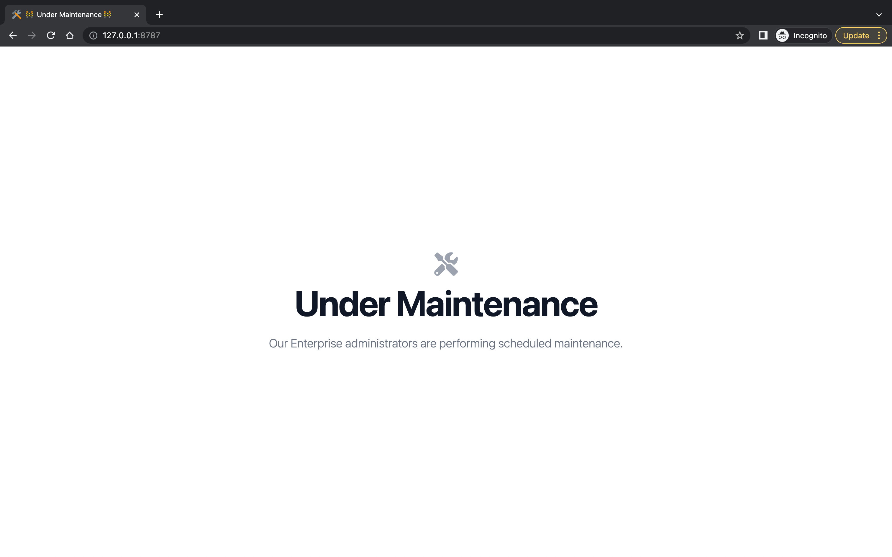

# CF Workers & TailwindCSS Maintenance application

Simple application served by Cloudflare Workers which interupts requests to your server while maintenance in progress.

## Features

- TailwindCSS
- Cloudflare Workers
- Easy to use CLI script which enables and disables page (TBD)


## Deployment

To deploy this page run

```bash
npm install
npm run workers:deploy
```


## Page Customization

You can run `npm run watch` and start writing your TailwindCSS classes in `public/index.html`.
## How to enable maintenance mode?

#### Manually

* Deploy your page
* Login your Cloudflare Dashboard
* Navigate to `maintenance-screen` worker `routes` page
* Enable wildcard routing for your zone (eg: `domain.dev/*` or `*.domain.dev/*`)

_Done, all your traffic will be routed to maintenance page._

#### CLI
Development of CLI script in progress and will be released soon.
## Authors

- [@oleghalin](https://github.com/oleghalin)


## Screenshots


